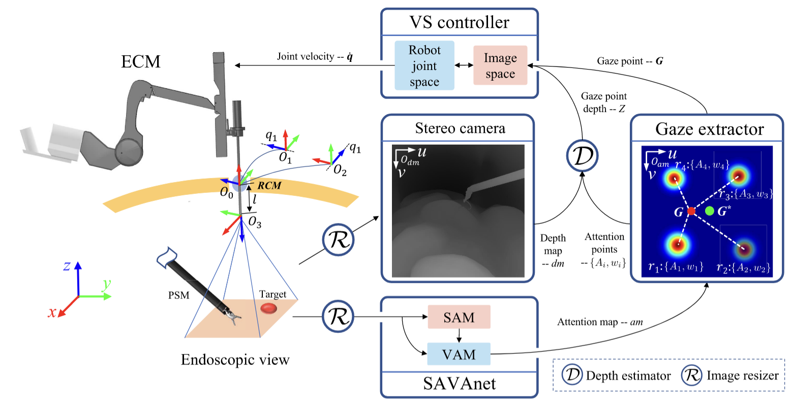

# SAVAnet

### Code would be released soon.
This is the official code for SAVAnet: Surgical Action-Driven Visual Attention Network for Autonomous Endoscope Control.

**Gao, Huxin\* and Fan, Weichen\* and Qiu, Liang and Yang, Xiaoxiao and Li, Zhen and Zuo, Xiuli and Li, Yanqing and Meng, Max Q-H and Ren, Hongliang**

[SAVAnet: Surgical Action-Driven Visual Attention Network for Autonomous Endoscope Control](https://www.researchgate.net/publication/363686020_SAVAnet_Surgical_Action-Driven_Visual_Attention_Network_for_Autonomous_Endoscope_Control)
## Citation
If you find our work useful for your research, please cite
~~~s
@article{gao2022savanet,
  title={SAVAnet: Surgical Action-Driven Visual Attention Network for Autonomous Endoscope Control},
  author={Gao, Huxin and Fan, Weichen and Qiu, Liang and Yang, Xiaoxiao and Li, Zhen and Zuo, Xiuli and Li, Yanqing and Meng, Max Q-H and Ren, Hongliang},
  journal={IEEE Transactions on Automation Science and Engineering},
  year={2022},
  publisher={IEEE}
}
~~~

## Change Log
* Sep 29, 2022: Initial commit 